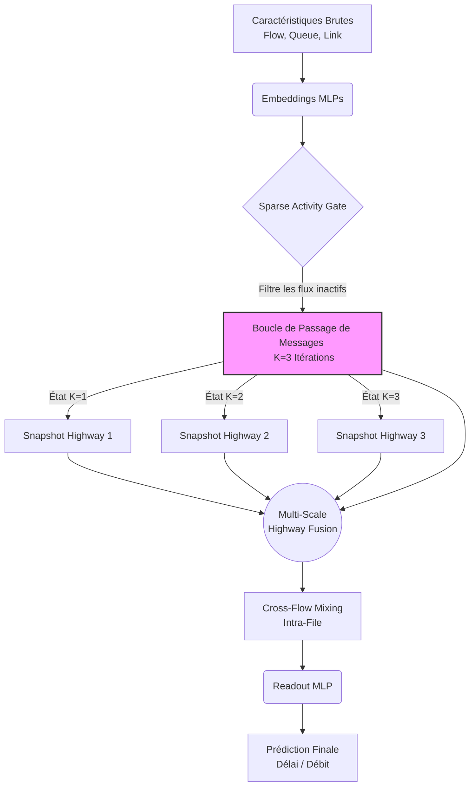
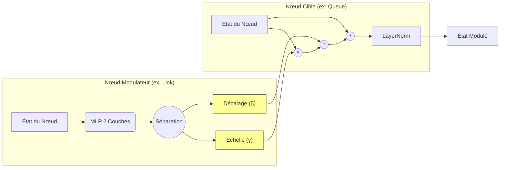

# Architecture du Modèle : WirelessNet-Fermi FiLM & Highway (Student)

Ce document explique l'architecture du modèle défini dans `student_film.py`. Il s'agit d'une architecture GNN (Graph Neural Network) étudiante légère et inspirée par la physique, conçue pour la distillation de connaissances à partir du modèle professeur WirelessNet-Fermi v3. 

Au lieu de simplement réduire la taille du modèle professeur qui est très lourd (basé sur le Multi-Head Attention), ce modèle réingénierie le flux d'informations en utilisant plusieurs innovations architecturales.

## 1. Vue d'Ensemble

L'objectif principal est d'obtenir un modèle à faible latence pour les jumeaux numériques sans-fil (Wireless Digital Twins) tout en conservant une grande précision. L'architecture globale est illustrée ci-dessous :



L'architecture repose sur :
- Des mécanismes de modulation (FiLM) au lieu de l'attention croisée.
- Une agrégation allégée (Gated Scatter Aggregation).
- Des connexions résiduelles denses à multi-échelles (Highway Fusion).

## 2. Les 5 Piliers Architecturaux (Building Blocks)

### A. FiLM Modulation (`FiLMBlock`)
Au lieu d'utiliser un mécanisme lourd d'attention croisée (Cross-Attention) entre les nœuds (ex: de Link vers Queue), le modèle utilise la *Feature-wise Linear Modulation* (FiLM). 
Physiquement, dans les réseaux sans-fil, le SINR et la distance atténuent de manière multiplicative la capacité. Ici, un nœud modulateur (ex: Link) génère des coefficients d'échelle (γ) et de décalage (β) qui modulent la représentation d'un nœud cible (ex: Queue).


- **Avantage :** La complexité passe de $\mathcal{O}(H \cdot Q \cdot L \cdot D)$ à $\mathcal{O}(D)$, n'utilisant que des opérations élémentaires.

### B. Agrégation Allégée avec Porte (`GatedScatterAggregation`)
Remplace le mécanisme de `FlowToQueueAttention`. Ce module :
1. Calcule un score de pertinence pour chaque flux (Flow) via un petit MLP.
2. Applique un `grouped_softmax` pour normaliser les scores par file d'attente (Queue).
3. Agrège les valeurs pondérées via `scatter_sum`.
- **Avantage :** Complexité de $\mathcal{O}(F \cdot D)$ contre $\mathcal{O}(F \cdot H \cdot D^2)$ pour l'attention multi-têtes.

### C. Réseau Feed-Forward Compact (`CompactFFN`)
Utilise un facteur d'expansion réduit de 1.5x (au lieu de 2x chez le professeur) pour économiser des paramètres.

### D. Porte d'Activité Clairsemée (`SparseActivityGate`)
Apprend un score d'activité pour chaque flux à partir des caractéristiques brutes (raw features). Les flux inactifs voient leurs mises à jour atténuées très tôt, économisant de la puissance de calcul.

### E. Mélange Cross-Flow Allégé (`CrossFlowMixing`)
Alternative légère à l'attention totale entre flux (`CrossFlowAttention`). Elle calcule une moyenne (scatter-mean) au sein de chaque groupe de file d'attente et utilise une porte apprenable, évitant ainsi le coût de l'attention paire-à-paire en $\mathcal{O}(F^2)$.

## 3. Déroulement du Modèle (Forward Pass)

Au cœur du modèle se trouve la boucle de passage de messages. Pour chaque itération (K=3), les 5 étapes de propagation sont appliquées de manière séquentielle :

```mermaid
graph TD
    subgraph "Itération de Passage de Messages (répété K fois)"
        F[État Flux (Flow)]
        Q[État File (Queue)]
        L[État Lien (Link)]
        
        F -- "① F→Q" --> Q1(Gated Scatter Aggregation + GRU)
        Q1 --> Q_new1[Nouvel État File]
        
        L -- "② L→L" --> L1(Self-Mixing Allégé)
        L1 --> L_new1[Nouvel État Lien]
        
        L_new1 -- "③ L→Q" --> Q2(FiLM Modulation + GRU)
        Q_new1 --> Q2
        Q2 --> Q_new2[État File Final]
        
        Q_new2 -- "④ Q→L" --> L2(FiLM Modulation Inversée)
        L_new1 --> L2
        L2 --> L_final[État Lien Final]
        
        Q_new2 -- "⑤ Q→F" --> F1(Gated Message + GRU + FFN)
        F --> F1
        F1 --> F_final[État Flux Final <br> Snapshot pour Highway]
    end
    
    style Q1 fill:#e1f5fe,stroke:#01579b
    style L1 fill:#e1f5fe,stroke:#01579b
    style Q2 fill:#fff3e0,stroke:#e65100
    style L2 fill:#fff3e0,stroke:#e65100
    style F1 fill:#f1f8e9,stroke:#33691e
```

Le flux de traitement global :

1. **Plongements Initiaux (Embeddings) :** Les caractéristiques brutes passent dans des MLPs à 2 couches.
2. **Filtrage Initial (Sparse Activity Gate) :** Les flux sont filtrés.
3. **Passage de Messages (K=3 Itérations) :** (Voir schéma ci-dessus). À la fin de chaque itération, l'état actuel des flux (`flow_state`) est sauvegardé (Snapshot Highway).
4. **Multi-Scale Dense Highway Fusion :** Tous les instantanés (snapshots) des $K$ itérations sont concaténés. Un MLP combine ensuite ces différents niveaux de représentation et les ajoute à l'état final via une connexion résiduelle. Cela permet de capturer la structure locale et globale du graphe.
5. **Mélange Cross-Flow final :** L'état des flux est mélangé au sein de chaque file d'attente à l'aide du module `CrossFlowMixing`.
6. **Lecture (Readout) :** L'état final passe par un MLP pour produire une prédiction scalaire (délai ou débit).

## 4. Bilan
Le `WirelessNetFermiStudent` est optimisé pour être rapide et économe en mémoire en remplaçant la majorité des calculs lourds liés à l'Attention (MHA) par des concepts physiques modélisés via FiLM et de simples agrégations dispersées (scatter/gather) avec des mécanismes de portes (gates).
