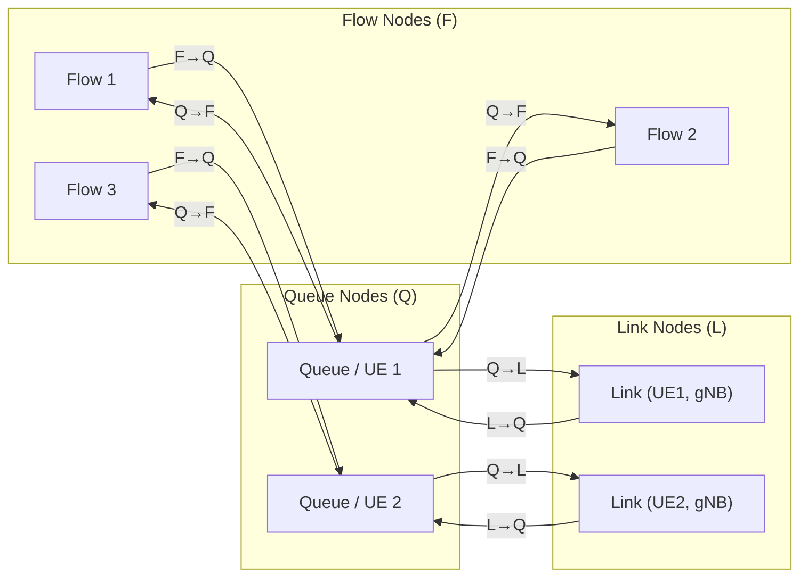
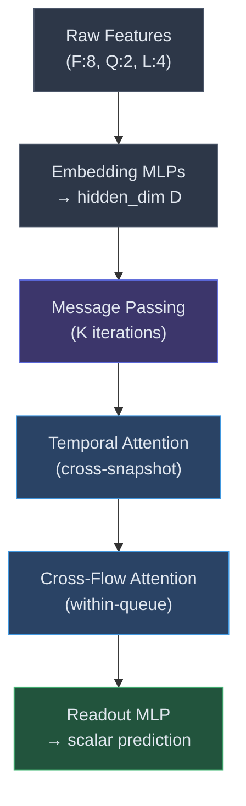
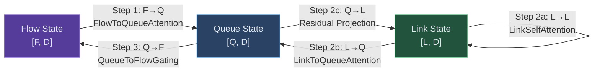
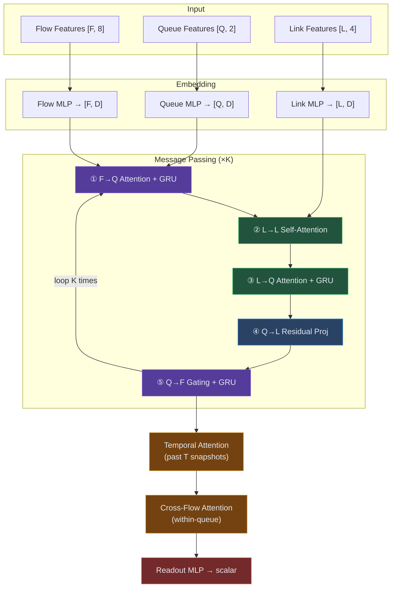

# WirelessNet-Fermi v2 — Model Architecture

---

## Overview

**WirelessNet-Fermi v2** is a heterogeneous Graph Neural Network (GNN) with a **full attention architecture**, designed to predict per-flow QoS metrics (end-to-end **delay** or **throughput**) in a 5G wireless network. Two specialised instances of the same architecture are trained independently — one for each prediction target.

The model operates on a **dynamic tripartite graph** with three node types and four edge types, and employs **5 distinct attention mechanisms** across its message-passing loop, temporal context module, and readout head.

---

## 1. Tripartite Graph Structure

The input graph  models each network snapshot as three sets of nodes:



| Node Type | Count | Feature Dim | Features |
|-----------|-------|-------------|----------|
| **Flow (F)** | `n_flows` | 8 | `packet_size`, `interval`, `throughput`, `offered_load`, `packet_loss`, `harq_error_rate`, `harq_tx_attempts`, `delivery_ratio` |
| **Queue (Q)** | `n_queues` | 2 | `qsize_bytes`, `mac_buffer_overflow` |
| **Link (L)** | `n_links` | 4 | `sinr_dl`, `sinr_ul`, `distance`, `speed` |

> [!NOTE]
> There is **one Queue per UE** with active flows and **one Link per (UE, serving gNB)** pair. Multiple flows from the same UE share the same Queue node.

---

## 2. High-Level Pipeline



---

## 3. Embedding Layer

Each node type has its own **2-layer MLP** that projects raw features into a shared hidden dimension `D` (default 64):

```
flow_embedding:   Linear(8 → D) → ReLU → Linear(D → D) → ReLU
queue_embedding:  Linear(2 → D) → ReLU → Linear(D → D) → ReLU
link_embedding:   Linear(4 → D) → ReLU → Linear(D → D) → ReLU
```

All three node types now live in the **same D-dimensional space**, enabling cross-type attention.

---

## 4. Message Passing (K Iterations)

The core of the model runs `K` iterations (default 8) of heterogeneous message passing. Each iteration contains **4 directed message steps**, wiring information through the full tripartite graph:



---

### Step 1 — FlowToQueueAttention (F → Q) 

**Purpose**: Each queue aggregates information from its flows, weighted by criticality (e.g., flows with high offered load or packet loss receive more attention).

**Mechanism**: Multi-head scaled dot-product attention where **Query = queue state** and **Key/Value = flow states**.

$$
e_{ij} = \frac{(W_q \cdot h_{q_i})^\top \cdot (W_k \cdot h_{f_j})}{\sqrt{d_h}}
$$
$$
\alpha_{ij} = \text{softmax}_j(e_{ij}) \quad \text{(over flows of queue } i\text{)}
$$
$$
\text{agg}_i = \sum_j \alpha_{ij} \cdot W_v \cdot h_{f_j}
$$

**State update**: The aggregated message is fused into the queue state via a **GRUCell**:
```
queue_state = GRU(flow_agg, queue_state)
```

> [!TIP]
> The `grouped_softmax` utility computes a numerically-stable softmax **per-group** (per-queue), so each queue's attention weights sum to 1 independently.

---
### Step 2a — LinkSelfAttention (L → L) 

**Purpose**: Model **inter-cell interference** — a link with low SINR attends to neighbouring high-power links that may be causing the interference.

**Mechanism**: Standard all-pairs `nn.MultiheadAttention` over all link nodes.

```
link_state = LayerNorm(link_state + MHA(link_state, link_state, link_state))
```

- Complexity is O(L²), acceptable because L (number of UE links) is typically < 30 per snapshot.
- Includes **residual connection + LayerNorm**.

---

### Step 2b — LinkToQueueAttention (L → Q) 

**Purpose**: Each queue absorbs radio-level information (SINR, distance, speed) from its serving link, **weighted by attention** so the model can learn which radio conditions matter most.

**Mechanism**: Identical architecture to FlowToQueueAttention but with `Query = queue`, `Key/Value = link`.

**State update**:
```
queue_state = GRU(link_msg, queue_state)
```

---

### Step 2c — Queue → Link Residual (Q → L) 

**Purpose**: Feed **queue load** (buffer fullness, congestion signals) back to the link, so subsequent L→L attention rounds can account for load-induced interference.

**Mechanism**: Simple linear projection with `tanh` activation and a residual:

```python
q_msg      = Linear(queue_state[link_to_queue])   # [L, D]
link_state = link_state + tanh(q_msg)             # residual gating
```

---

### Step 3 — QueueToFlowGating (Q → F)

**Purpose**: Propagate updated queue/radio information back to individual flows. Instead of **broadcasting the same state** to all flows of a queue, each flow computes a **personalised gate**, so flows in poor conditions (high packet loss, low delivery ratio) amplify the queue signal.

**Mechanism**: Sigmoid-gated value passing:

$$
g_i = \sigma\left(W_{\text{gate}} \cdot [h_{f_i} \| h_{q_{f2q_i}}]\right)
$$
$$
\text{msg}_i = g_i \odot W_v \cdot h_{q_{f2q_i}}
$$

Where `‖` is concatenation and `⊙` is element-wise multiplication.

**State update**:
```
flow_state = GRU(flow_msg, flow_state)
```

> [!IMPORTANT]
> All three GRUs (`fq_gru`, `lq_gru`, `qf_gru`) act as **recurrent memory gates** across the K message-passing iterations, allowing the model to incrementally refine node states rather than overwriting them at each step.

---

## 5. Temporal Attention (Cross-Snapshot Memory) 

After message passing, if enabled (`use_temporal=True`), the model applies **temporal attention** over a sliding window of past flow-state snapshots (default window: 8).

**Purpose**: Track flows across **handovers and mobility events** — a UE moving between cells will have different serving links across snapshots.

**Mechanism**:
1. Past flow states are aligned to the current flow count (pad/crop rows).
2. Learned **positional embeddings** encode temporal order.
3. `nn.MultiheadAttention` with `Query = current flow state`, `Key/Value = stacked history`.

```
history:   [T, F, D]  (T past snapshots, aligned to current F)
output:    LayerNorm(flow_state + MHA(flow_state, history, history))
```

---

## 6. Cross-Flow Attention (Readout Refinement) 

Before the final prediction, flows that share the **same queue** (i.e., belong to the same UE) attend to each other.

**Purpose**: Capture **co-located flow correlations** — e.g., two video streams from the same UE compete for the same MAC buffer, so their delays are correlated.

**Mechanism**: Full self-attention with a **same-queue mask**:

```python
scores = einsum('ihd,jhd->ijh', Q, K) * scale   # [F, F, H]
mask   = (flow_to_queue[i] != flow_to_queue[j])  # block cross-queue
scores[mask] = -inf
alpha  = softmax(scores, dim=1)                  # [F, F, H]
```

Includes **residual + LayerNorm**.

---

## 7. Readout Head

A 3-layer MLP maps each flow's final hidden state to a **single scalar** prediction:

```
Linear(D → D) → ReLU → Dropout(0.1)
Linear(D → D/2) → ReLU → Dropout(0.1)
Linear(D/2 → 1)
```

Output shape: `[n_flows]` — one prediction per active flow.

---

## 8. Full Architecture Summary



---

## 9. Hyperparameters

| Parameter | Default | Description |
|-----------|---------|-------------|
| `hidden_dim` | 64 | Embedding and hidden state dimension (D) |
| `num_heads` | 4 | Attention heads for all attention modules |
| `iterations` | 8 | Message-passing rounds (K) |
| `dropout` | 0.1 | Dropout rate in the readout MLP |
| `max_history` | 8 | Temporal attention window (T snapshots) |
| `use_temporal` | True | Enable/disable temporal attention |
| `target` | `'delay'` | Prediction target: `'delay'` or `'throughput'` |

---

## 10. Key Design Decisions

| Decision | Rationale |
|----------|-----------|
| **GRU state updates** instead of additive residuals | Provides a learnable forget/update gate across K iterations, preventing information wash-out in deep message passing |
| **Separate Q→F gating** per flow | Avoids the "broadcast" problem — each flow personalises how much queue state it absorbs based on its own condition |
| **L→L self-attention** | Captures inter-cell interference patterns that are invisible to node-local message passing |
| **Grouped softmax** | Custom numerically-stable softmax that partitions attention within logical groups (e.g., flows of the same queue) without needing dense attention masks |
| **Temporal positional embeddings** | Learned embeddings encode *when* each past snapshot occurred, so the model can weight recent states more heavily during handovers |
| **Dual-model specialisation** | Delay and throughput have very different distributions and loss landscapes, so separate model instances avoid negative transfer |
